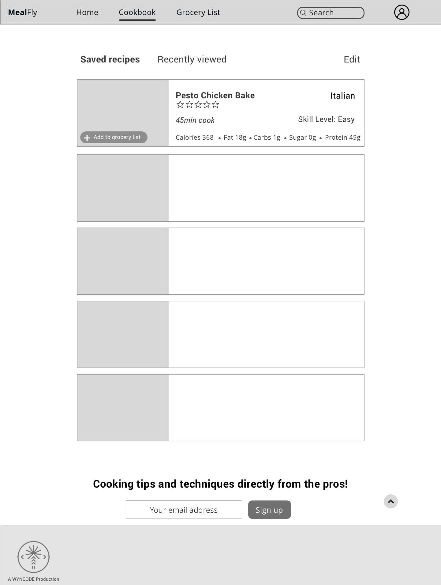
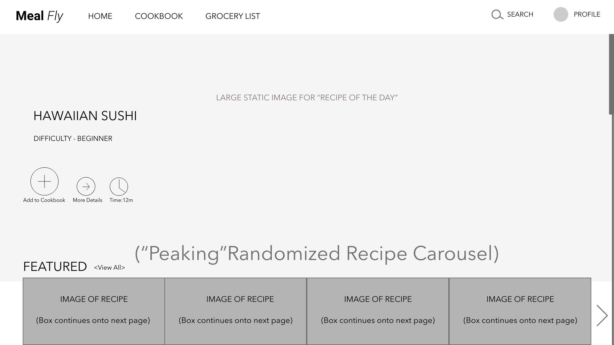
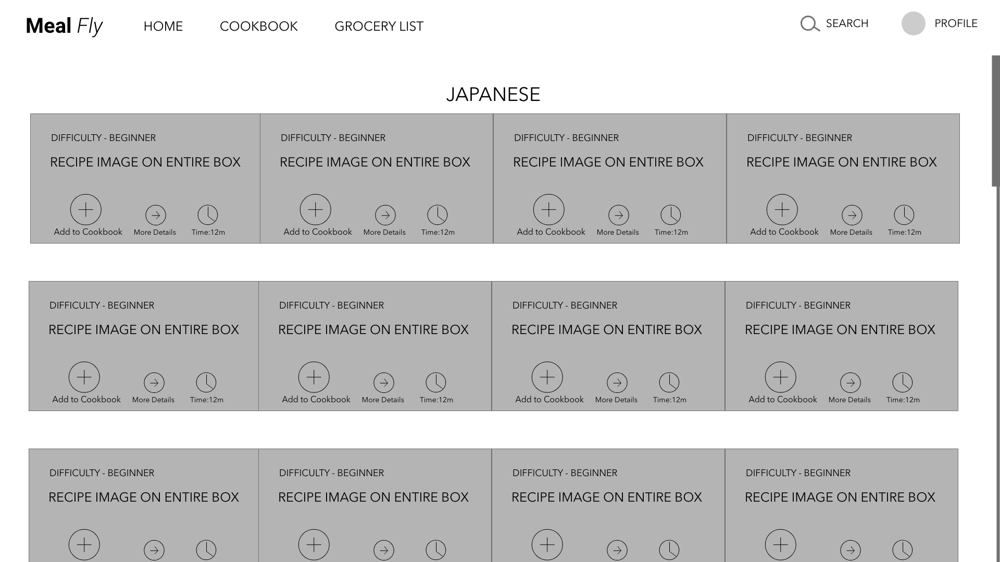
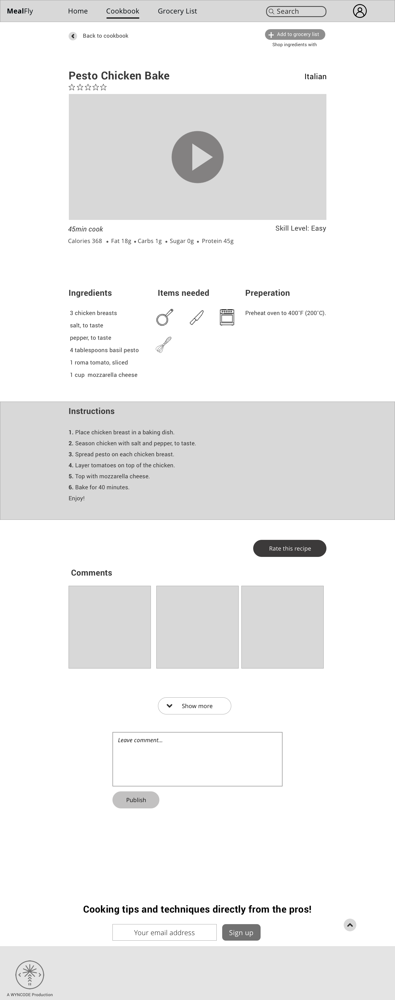
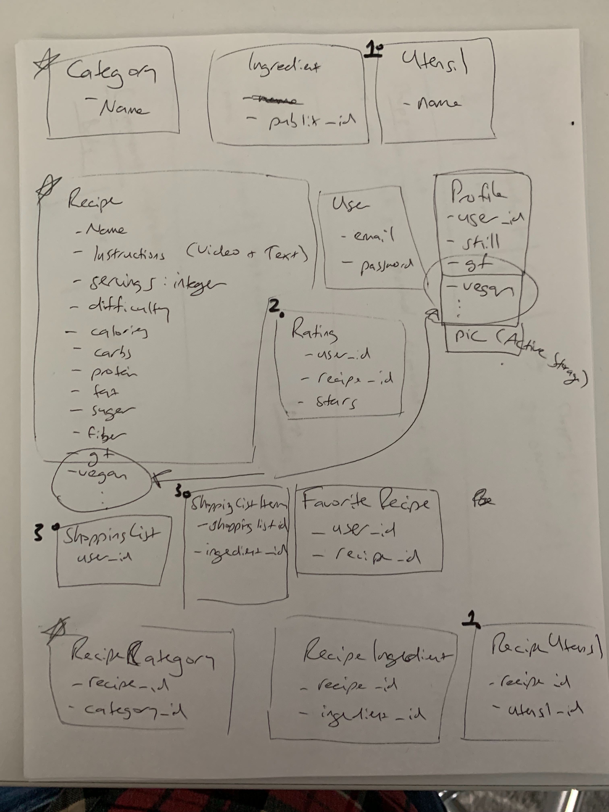

# visit site here https://meal-fly.herokuapp.com/
(please be patient with the free server)

Final team project for Wyncode Cohort 33. It won our pitch night due to the depth of its features, and built from scratch database.

## C33 Pitch Day Projects

Cookbook page - favorite recipes:

Home page top view:

Home page middle view:

Home page view-all view:

Recipe detail page:

ERD:

**NOTE** You will need to store the recipe video inside the instructions in the rich text... Since you want to use the image in multiple places, you should store it separately using ActiveStorage.
